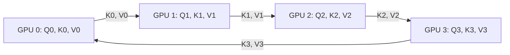

As Large Language Models scale, support for extremely long context windows (millions of tokens) has become a primary requirement. However, standard Transformers suffer from quadratic computational and memory complexity with respect to sequence length. 

**Ring Attention** is a distributed attention mechanism that addresses these memory constraints. By partitioning the sequence length dimension across multiple compute devices (GPUs) arranged in a logical ring, Ring Attention overlaps the communication of Key (K) and Value (V) tensors with the computation of attention, enabling context scaling limited only by the aggregate memory of the cluster.

---

## The Long-Context Memory Bottleneck

Standard Self-Attention requires computing the attention matrix $A = \text{softmax}(QK^T / \sqrt{d_k})V$. For a sequence of length $N$:
- The memory needed to store the intermediate attention matrix is $\mathcal{O}(N^2)$.
- Standard tensor parallelism splits model weights (heads or channel dimensions) across GPUs but keeps the sequence intact on each device, which fails when a single sequence exceeds one GPU's memory limit.
- FlashAttention optimizes single-device memory by tiling the inputs, but it does not scale across multiple GPUs.

Ring Attention solves this by partitioning the **sequence length** dimension $N$ across $P$ processors, so each GPU holds a chunk of length $N/P$.

---

## How Ring Attention Works

Instead of broadcasting Key and Value tensors across the network, Ring Attention routes these tensors in a ring topology.

Given $P$ devices in a ring:
1. **Local Computation:** Each device $i$ computes attention using its local Query chunk $Q_i$ and its local Key/Value chunks $K_i, V_i$.
2. **Ring Send/Receive:** Device $i$ sends its current Key/Value chunk to device $i+1$ and receives a new Key/Value chunk from device $i-1$.
3. **Overlapped Execution:** While device $i$ is computing attention between its local $Q_i$ and the newly received $K$ and $V$ blocks, it asynchronously triggers the next transfer of $K$ and $V$ to the next device.
4. **Reduction:** After $P-1$ steps, every device has computed the attention of its local $Q_i$ against the entire sequence's Keys and Values. The outputs are aggregated using the FlashAttention rescaling trick.



Because communication of $K, V$ blocks occurs concurrently with the block-wise attention matrix multiplications, the communication overhead is almost fully hidden behind execution time.

---

## FlashAttention Integration

Ring Attention incorporates the block-wise scaling mechanisms of FlashAttention. Because the softmax function requires a global denominator (the sum of exponentiated logits), each device maintains local scaling statistics:
- $m_i$: The running maximum logit value for $Q_i$
- $l_i$: The running sum of exponentials for $Q_i$

As new blocks of $K$ and $V$ arrive from the ring, the local attention outputs are iteratively rescaled:

$$\tilde{O}_{\text{new}} = \tilde{O}_{\text{old}} \cdot e^{m_{\text{old}} - m_{\text{new}}} + O_{\text{block}} \cdot e^{m_{\text{block}} - m_{\text{new}}}$$

---

## Implementation Concept

Below is a conceptual PyTorch snippet demonstrating one step of the Ring Attention loop using asynchronous communication.

```python
import torch
import torch.distributed as dist

def ring_attention_step(q_local, k_local, v_local, ring_rank, ring_size):
    # Determine ring neighbors
    send_to = (ring_rank + 1) % ring_size
    recv_from = (ring_rank - 1) % ring_size

    # Initialize local attention outputs
    out_local = torch.zeros_like(q_local)
    l_sum = torch.zeros(q_local.shape[0], 1, device=q_local.device)
    m_max = torch.full((q_local.shape[0], 1), -float('inf'), device=q_local.device)

    # Buffers for communication
    k_send, v_send = k_local.clone(), v_local.clone()
    k_recv, v_recv = torch.zeros_like(k_local), torch.zeros_like(v_local)

    for step in range(ring_size):
        # 1. Start asynchronous send/recv of K and V
        req_k = dist.isend(k_send, dst=send_to)
        req_v = dist.isend(v_send, dst=send_to)
        req_rk = dist.irecv(k_recv, src=recv_from)
        req_rv = dist.irecv(v_recv, src=recv_from)

        # 2. Compute attention on current block (overlapped)
        out_local, m_max, l_sum = flash_attention_update(
            q_local, k_send, v_send, out_local, m_max, l_sum
        )

        # 3. Wait for transfers to complete before updating buffers
        req_k.wait()
        req_v.wait()
        req_rk.wait()
        req_rv.wait()

        # Swap buffers for next iteration
        k_send, v_send = k_recv.clone(), v_recv.clone()

    # Finalize normalization
    out_local = out_local / l_sum
    return out_local
```

---

## Why Ring Attention Matters

- **Hardware Efficiency:** It avoids all-to-all or all-reduce collective communications, replacing them with simple point-to-point ring transfers.
- **Infinite Context:** Context length becomes linear with the number of GPUs. If 8 GPUs can handle 1 million tokens, 80 GPUs can handle 10 million tokens.
- **No Extra Compute:** The total FLOPS computed remains identical to standard attention, but memory allocation is distributed.
