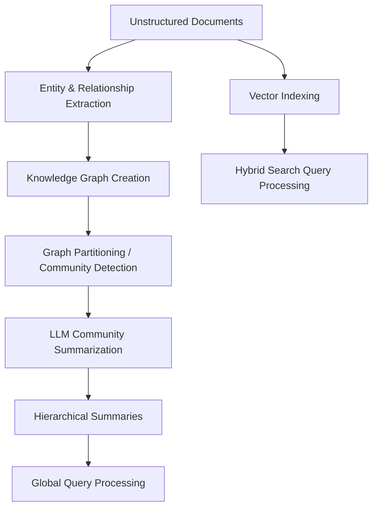

**Graph Retrieval-Augmented Generation (GraphRAG)** is an advanced RAG paradigm that combines traditional vector-based retrieval with structured **Knowledge Graphs (KGs)**. 

While standard RAG excels at answering local questions (e.g., *"What was the revenue of Company X in Q3?"*), it fails at answering global, thematic questions over entire datasets (e.g., *"What are the main ethical concerns raised across all these documents?"*). GraphRAG solves this by structuring unstructured text into a graph of entities, relationships, and claims, and then summarizing communities within the graph.

---

## Why Vector RAG Fails on Global Queries

Traditional RAG relies on chunking documents and using vector embeddings to find the top-$k$ most semantically similar chunks. This approach has three key limitations:
1. **Lack of Global Synthesis:** It cannot synthesize insights across thousands of chunks that contain disparate pieces of information.
2. **Missing Relationships:** It treats chunks as isolated islands of text, ignoring explicit connections (e.g., entity $A$ is the parent company of entity $B$).
3. **Redundancy:** If the same fact is repeated in many chunks, the top-$k$ results will be flooded with duplicate information, leaving no room for other context.

---

## The GraphRAG Pipeline

GraphRAG converts an unstructured document collection into a structured knowledge graph and leverages LLMs to generate hierarchical summaries of this graph.



### 1. Document Extraction and Graph Creation
The source documents are processed by an LLM to extract entities (people, places, organizations, concepts) and their relationships. These entities and relationships are represented as nodes and edges in a graph.

### 2. Community Detection
Large graphs are difficult to feed directly into an LLM context window. GraphRAG partitions the graph into clusters or "communities" using algorithms like the **Leiden community detection algorithm**. This groups highly interconnected nodes (e.g., a cluster of nodes representing a specific project or department within a company) together.

### 3. Community Summarization
An LLM generates a report/summary for each community at different hierarchical levels. These summaries capture the main themes, key entities, and significant events within that cluster.

### 4. Query Processing (Global Search)
When a user asks a global question:
- The system gathers the community summaries at a suitable level of the hierarchy.
- It distributes these summaries to an LLM to generate partial responses.
- It performs a final reduction step where the LLM synthesizes the partial answers into a single coherent, global response.

---

## Hybrid Search: Combining Vector and Graph

Advanced GraphRAG implementations use a hybrid search strategy that blends semantic vector search with graph traversal:

- **Local Search:** Combines vector search on chunks with entity-neighborhood retrieval (retrieving the node, its direct neighbors, and connected relations).
- **Global Search:** Relies entirely on pre-generated community summaries to answer thematic questions.

---

## Implementing GraphRAG with Python

Below is an overview of how you can build a simple GraphRAG query interface using LlamaIndex with a property graph database (like Neo4j).

```python
from llama_index.core import PropertyGraphIndex
from llama_index.embeddings.openai import OpenAIEmbedding
from llama_index.llms.openai import OpenAI
from llama_index.graph_stores.neo4j import Neo4jPropertyGraphStore

# 1. Initialize Vector and Graph Stores
graph_store = Neo4jPropertyGraphStore(
    username="neo4j",
    password="my_secure_password",
    url="bolt://localhost:7687"
)

# 2. Build the Index from Documents
# This automatically extracts entities/relationships using the LLM
index = PropertyGraphIndex.from_documents(
    documents,
    property_graph_store=graph_store,
    embed_model=OpenAIEmbedding(model="text-embedding-3-small"),
    llm=OpenAI(model="gpt-4o")
)

# 3. Create a Local Query Engine (Entity + Vector Context)
query_engine = index.as_query_engine(
    sub_retrievers=["vector", "keyword", "synonym"],
    similarity_top_k=5
)

response = query_engine.query("Explain the relationship between Project Orion and Client Acme.")
print(response)
```

---

## Performance and Cost Trade-offs

- **Indexing Cost:** GraphRAG has a high indexing cost. Creating the knowledge graph and summarizing communities requires massive numbers of LLM API calls.
- **Inference Cost:** For global queries, GraphRAG is highly efficient compared to brute-force map-reduce over all raw chunks, because it queries pre-synthesized community summaries.
- **Accuracy:** GraphRAG provides significantly better factual coverage and structural coherence on high-level thematic queries compared to standard RAG.
